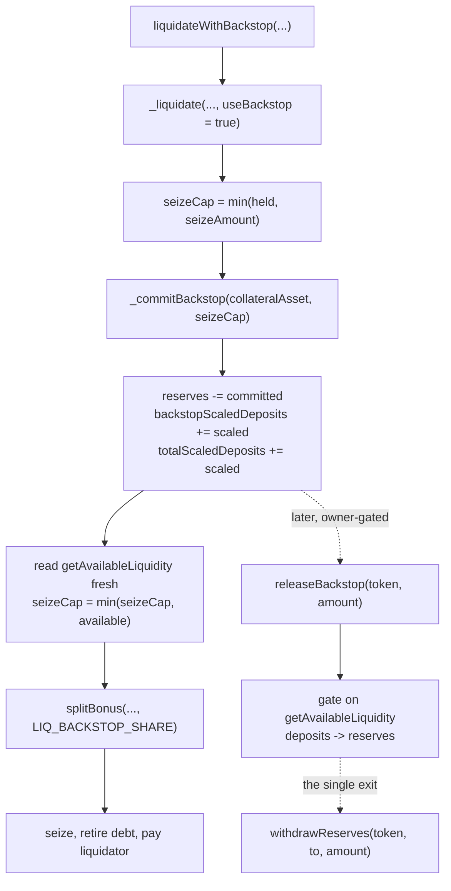

# 0006 — The internal liquidation backstop: reserves as a protocol-owned deposit

## Status

Accepted.

## Context

[[0004-liquidation-engine]] shipped with a documented hole: a liquidation can fail
against a position that is genuinely liquidatable, purely because the collateral pool
has no liquidity to give up. [[0005-treasury-withdrawal]] made `pool.reserves`
addressable and named closing that hole as the work it unblocked. This is that work —
the internal half of D2. The external half (flash-loaning the shortfall from an outside
venue) is untouched here.

The sharp version of the gap. `getAvailableLiquidity(token)` returns
`max(0, deposits - debt)`. The custody identity the same function's natspec states is
`cash = deposits + reserves - debt`. Substituting one into the other:

```
available = max(0, cash - reserves)
```

The figure the seizure clamps against under-reports the pool's real spendable cash by
exactly `min(reserves, cash)`. That quantity — the reserves — is invisible to every
flow limit in the contract while sitting in the contract as ordinary tokens.

Worse, the clamp bites in the ordinary case, not an exotic one. A pool whose deposits
sit below its debt reports zero available while still holding cash, and that is the
**normal** post-accrual state: `borrowIndex` grows faster than `liquidityIndex` by
exactly the reserve cut on every single accrual (see [[Accounting]]). The pool does not
have to be drained for the backstop to be the difference between a fill and a revert.

**Correcting 0004 while we are here.** 0004's Consequences describe this failure as
`liquidate()` reverting on `safeTransfer` against a cash-poor pool. That framing is
imprecise. The availability clamp bites first: `seizeCap` is clamped to
`getAvailableLiquidity`, `repayAmount` is back-solved down from the tighter cap, and
the call reverts with `Desultory__ZeroAmount` before any transfer is attempted. The
real failure mode is a **zero fill**, not a failed transfer. Per the vault's rule that
accepted ADRs are never edited to reflect a changed mind, 0004's body stands; this
record carries the correction.

## Decision

Two external entry points over one private implementation.
`liquidate(...)` is now a thin wrapper over
`_liquidate(positionId, debtAsset, collateralAsset, repayAmount, bool useBackstop)`,
joined by `liquidateWithBackstop(...)` with the identical argument list. `useBackstop`
changes exactly two things: the seizure cap may draw on committed reserves, and the
bonus split receives `LIQ_BACKSTOP_SHARE` instead of `LIQ_PROTOCOL_SHARE`.
`nonReentrant` sits on the two wrappers and never on `_liquidate`, so the two cannot be
composed into a re-entrant path.

Five decisions, each with its reasoning:

1. **Reserves are converted into a protocol-owned deposit, not spent.**
   `_commitBackstop(token, want)` moves value from `pool.reserves` into a new pool line,
   `backstopScaledDeposits`, and into `totalScaledDeposits`. No token moves — reserves
   were already cash sitting in this contract, so only the split between "protocol
   revenue" and "deposit base" changes. Both sides of
   *cash = deposits + reserves − debt* move together, so
   `property_custodyReconciles` is preserved **by construction rather than by a check**
   — the same argument 0005 makes for `withdrawReserves`. Spending reserves outright
   would have lowered one side of that identity without the other, which is precisely
   the shape of a custody bug.

   `backstopScaledDeposits` is a **subset** of `totalScaledDeposits`, never a parallel
   figure, and it is deliberately not a position. `withdraw()` keys off
   `__scaledDeposits[positionId][token]` behind `onlyPositionOwner`, so there is no
   path by which a user call can reach protocol capital.

2. **The commit is sized from raw `deposits` and `debt`, never from
   `getAvailableLiquidity`.** `_commitBackstop` reads
   `__fromScaledDown(totalScaledDeposits, liquidityIndex)` and
   `__fromScaledUp(totalScaledBorrows, borrowIndex)` directly, computes
   `need = (debt + want) - deposits`, and clamps that to `pool.reserves`. Sizing from
   the clamped view would have been the obvious thing to write and would have been
   silently useless: that view floors a deposits-below-debt pool at zero, and — per the
   Context above — a pool is in that state after every accrual, so the commit would
   under-commit by the entire deficit and the backstop would do nothing in exactly the
   case it exists for.

   The credit is converted to scaled units rounding **down**, the direction `deposit()`
   uses, so the protocol never receives more deposit claim than it paid for; and
   `pool.reserves` is decremented by the exact round-trip of that scaled figure rather
   than by `need`, so no dust drifts between the two lines.

   Ordering inside `_liquidate` matters twice. The commit runs **after** `seizeCap` is
   clamped to both the position's actual collateral and the requested seize amount, so
   nothing is committed when collateral rather than liquidity is what binds — reserves
   spent to unlock liquidity for collateral that is not there would be pure waste. It
   runs **before** `getAvailableLiquidity` is read for the final clamp, and that read is
   taken fresh rather than incremented by an assumed amount, because the down-rounded
   credit can land a wei short of what was asked for.

3. **`LIQ_BACKSTOP_SHARE = 7_000`, the mirror of the ordinary 3000 split, taken out of
   the liquidator's bonus.** On the backstop path the protocol is the one carrying the
   pool's liquidity risk (consequence 1 below), so it keeps 70% of the bonus instead of
   30%. The extra share comes out of the liquidator's cut and is **not** charged to the
   position: the borrower gives up the same seizure either way, so `seizeFromRepay`,
   `healthFactor` and the close factor are untouched and the borrower is not penalized
   for a pool illiquidity they did not cause.

   The liquidator still clears a profit, which is what makes the path usable: against
   WETH's 1000bps bonus, 30% of the bonus is about +3%; against USDC's 500bps, about
   +1.5%. Thin, deliberately — this path is a last resort, not the default trade.

4. **A separate entry point, not an automatic fallback.** `liquidate()` never escalates
   into the backstop on its own. A liquidator bot quotes its profit off-chain against
   the 30% split; silently paying it the 70% split because the pool happened to be
   short would hand it a worse trade than the one it priced. Choosing
   `liquidateWithBackstop` **is** the consent. The cost is that a caller must decide in
   advance, which is a decision an off-chain bot is well placed to make since it can
   read `getAvailableLiquidity` and `pool.reserves` before it sends.

5. **`releaseBackstop(token, amount)` returns capital to reserves rather than
   transferring it out.** Owner-gated, and the exact mirror of the commit: it accrues
   first so the interest the deposit earned through `liquidityIndex` is realized,
   mirrors `withdraw()`'s shape (full-balance shortcut, `__toScaledUp` for the partial
   case, clamp, then the gate), and converts the deposit back into `pool.reserves`
   without moving a token. Cash therefore still leaves the contract through exactly one
   door, the pre-existing `withdrawReserves`, whose custody argument is unchanged.

   Unlike `withdrawReserves`, the release **does** need a liquidity gate, and the
   asymmetry is the point: `withdrawReserves` lowers the balance and `pool.reserves`
   together, so custody holds by construction, whereas `releaseBackstop` lowers deposits
   against a fixed reserve backing — exactly what `withdraw()` does, so it gets exactly
   the gate `withdraw()` gets. This is also what makes the liquidity risk in consequence
   1 real rather than nominal: the owner cannot unwind the position until utilization
   falls.



## Consequences

- **The protocol now carries liquidity risk it did not carry before.** Committing
  reserves makes it a lender in a pool it cannot withdraw from until utilization falls.
  That is the real cost of the mechanism, and `LIQ_BACKSTOP_SHARE` is what pays for it.
  Committed capital is not lost — it earns `liquidityIndex` like any other deposit and
  `releaseBackstop` realizes that interest on the way back — but it is illiquid, and a
  pool that stays saturated keeps it illiquid indefinitely.
- **`property_scaledBalancesReconcile` carries a second term.** It now reads
  `sum(per-position scaled deposits) + backstopScaledDeposits == totalScaledDeposits`.
  Still exact equality with one more known term — a strengthening, not a loosened
  bound. A new property, `property_backstopNeverExceedsDeposits`, asserts the subset
  relation directly. See [[Invariants]].
- **The wei-scale rounding seam is widened, not merely inherited.** The design spec for
  this work claimed the backstop "inherits, does not widen" the seam
  [[0004-liquidation-engine]] parked. **That claim was wrong**, and the correction
  belongs in the record rather than in a footnote.

  `_seizeCollateral` decrements the scaled deposit with `__toScaledUp` while the
  availability bound is computed in token units, so a seizure that *exactly saturates*
  the cap can leave a pool's deposits 1–2 wei below its debt. On the ordinary path that
  precondition holds only sometimes, and holds exactly only rarely. On the backstop
  path `seizeCap` is set to precisely the availability the commit just unlocked, so the
  precondition holds on **every** call. What 0004 documents as an edge case is routine
  here. The commit's own down-rounding adds a second floor in the same direction,
  bounded by `liquidityIndex / WAD`.

  Observed in testing: a deterministic 2-wei shortfall against a ~449,740-token pool.

  It is still not worth patching, for the reason it was parked originally — the fix is
  an unexplained `-1` — and nothing it can reach cares.
  `property_borrowIndexOutpacesLiquidityIndex` needs roughly a 10% deficit.
  `property_utilizationNeverExceeds100` holds because `getUtilization` clamps at
  `MAX_BPS`. `property_custodyReconciles` is a `gte` whose right-hand side the
  shortfall moves *down*, so the rounding runs in the property's favour. The unit test
  `testBackstopLeavesDepositsCoveringDebtWithinRoundingDust` accordingly asserts the
  shortfall is dust (≤ 10 wei) rather than zero, and says why. See [[Liquidations]]'s
  Known limitations.
- **The external half of D2 is still open.** The backstop reaches cash the protocol
  already holds. A pool with no reserves and no spare liquidity still fails, and no
  amount of internal bookkeeping fixes that — it needs outside capital, which is the
  flash-loan half and has no spec yet.
- **`dusdReserves` is still not withdrawable and still not usable here.** It is a claim
  rather than a balance, so there is nothing to commit; 0005's reasoning applies
  unchanged and the question remains C2's to revisit.
- **Two owner powers were added.** `releaseBackstop` is owner-gated, so the owner key
  gains one more lever over protocol capital on top of the one 0005 gave it. It cannot
  move tokens out on its own — the exit is still `withdrawReserves` — but the
  accumulation of owner surface is worth naming.

## What this supersedes, and what it does not

[[0004-liquidation-engine]] is not edited. Two of its statements are refined here and
both refinements live in this record:

- Its Consequences describe the cash-poor failure as a reverting `safeTransfer`. The
  actual failure is a zero fill (`Desultory__ZeroAmount`) driven by the availability
  clamp — corrected in the Context above.
- Its final Consequence parks the wei-scale rounding seam as an edge case. On the
  backstop path it is routine — corrected in the Consequences above.

0004's core design — single logical entry, clamp-and-count, bad debt recognized and
never socialized — is unchanged and not revisited. [[0005-treasury-withdrawal]] is
likewise untouched; its custody argument is the load-bearing precedent for decision 1
and is extended, not contradicted.

## Alternatives considered

- **Raise the seizure cap to the pool's cash instead of committing reserves.** The
  smallest possible change, and wrong. It leaves deposits below debt after the seizure,
  which pushes utilization above 100%, sends `getBorrowRate` past the end of its kinked
  curve, and exposes both index properties. That is the *same class of failure* Medusa
  caught at ~98k calls when `_seizeCollateral` had no liquidity bound at all — the bug
  that put the bound there in the first place. Removing the bound to solve the problem
  the bound creates is a circle.
- **A protocol-owned position NFT holding the backstop deposit.** Attractive because it
  would keep `property_scaledBalancesReconcile` byte-for-byte — the protocol's deposit
  would simply be one more position in the sum. Rejected: it puts treasury capital
  behind the NFT transfer gate and the health machinery, which are designed for user
  positions and would now govern protocol funds, and it still needs an internal
  withdrawal path because `withdraw()` pays to `msg.sender`. More surface for a
  cosmetic invariant win.
- **The protocol as liquidator of last resort** — the protocol liquidates the position
  itself and holds the collateral. Rejected: it runs into the identical
  deposits-below-debt bound, because the seizure is the same seizure whoever calls it.
  It would need this mechanism underneath it anyway, so it is a layer on top of this
  decision rather than an alternative to it.
- **A per-token backstop cap, or an arming switch the owner flips per pool.** A real
  risk control and probably the right thing eventually. Rejected for now: deciding who
  sets the cap, how it is changed and on what timelock needs a governance framework the
  protocol does not have (`VoteToken` is a bare OFT). Adding an owner-set risk parameter
  before that exists prejudges it, the same argument 0005 makes about `dusdReserves` and
  the peg.

## Related

- [[Liquidations]] — the engine, both entry points, and the seam in Known limitations
- [[Accounting]] — the custody identity, the reserve lines, and why `available` under-reports cash
- [[Invariants]] — property 1's second term, property 11's two shares, and property 12
- [[0004-liquidation-engine]] — the ADR that shipped this gap, and whose framing of it is corrected here
- [[0005-treasury-withdrawal]] — the ADR that made reserves addressable, and the custody argument reused here
