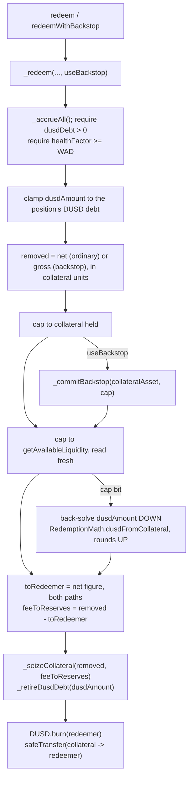

# 0007 — DUSD redemption: arbitrage enforces the par convention the health check assumes

## Status

Accepted.

## Context

`userBorrowedAmountUSD` adds a position's DUSD debt at $1. That is a convention with
nothing behind it. [[0003-dusd-only-cross-chain-borrowing]] recorded it as an assumption
and named project C2 as the place it would be settled; [[0005-treasury-withdrawal]]
deferred the `dusdReserves` outlet to the same place, because paying out a claim against
an unpegged unit is a monetary decision, not treasury plumbing. This is that project's
first piece.

The assumption stopped being cosmetic when [[0004-liquidation-engine]] shipped.
`healthFactor` divides threshold-weighted collateral by `userBorrowedAmountUSD`, so the
seizure trigger inherits the par convention for every DUSD borrower. A drift mis-prices
that trigger in **both** directions:

- **Below $1**, debt is overstated. Positions cross the seizure line while their real
  liability is smaller than the contract believes, and get liquidated early — at a
  bonus, with the collateral gone.
- **Above $1**, debt is understated. Positions that are genuinely under-collateralized
  read as healthy, no liquidator can touch them, and the protocol accrues bad debt it
  does not recognize. `totalBadDebtUSD` stays silent because the sweep only runs inside
  a liquidation that never happens.

The second direction is the worse one, and it is the one no invariant can see: the whole
fuzzing harness asserts internal consistency ([[0002-internal-consistency-invariants]]),
and a book that is consistent with a wrong price is still consistent.

There are two ways to close this. Price DUSD with an oracle, or make the price true. An
oracle prices the drift; it does nothing to stop it, and it imports a manipulable feed
directly into the liquidation trigger of every DUSD borrower. Making the price true means
giving DUSD a floor a holder can reach without asking anyone's permission.

## Decision

**DUSD is redeemable for collateral at par, less a flat fee, against any healthy
position.**

```solidity
redeem(uint256 positionId, address collateralAsset, uint256 dusdAmount)
redeemWithBackstop(uint256 positionId, address collateralAsset, uint256 dusdAmount)
```

Both are thin `nonReentrant` wrappers over
`_redeem(positionId, collateralAsset, dusdAmount, bool useBackstop)` — the same shape
[[0006-internal-liquidation-backstop]] gave `liquidate`, and for the same reason:
`nonReentrant` sits on the wrappers and never on the private implementation, so the two
cannot be composed into a re-entrant path.

Five decisions, each with its reasoning:

1. **Redemption is the peg mechanism, and `userBorrowedAmountUSD` is deliberately left
   alone.** A redeemer burns `D` of DUSD and receives collateral worth `D·(1−f)` in USD
   from a position whose DUSD debt is cancelled by `D` at par. If DUSD trades below
   `$1−f`, buying it on-market and redeeming here returns more value than it cost, and
   every such trade burns supply. The discount closes because arbitrage closes it.

   So the par convention in `userBorrowedAmountUSD` survives untouched — what changes is
   that it is now *enforced* rather than *assumed*. The only edit to that function is its
   comment, which used to be an admission that the peg had no mechanism and now points at
   the one it has. Changing the valuation itself would have been the oracle answer wearing
   a different hat.

2. **Only healthy positions are redeemable: `healthFactor >= WAD`, the exact inverse of
   `liquidate`'s `healthFactor < WAD`.**

   The derivation matters, because "healthy" is a choice and not an obvious one. Write
   `W` for the position's threshold-weighted collateral USD, `Dt` for its total debt USD,
   `HF = W/Dt`, `w_A` for the liquidation threshold of the seized asset, and `f` for the
   fee. A redemption of `D` DUSD removes `X = D·(1−f)` of collateral USD and cancels `D`
   of debt:

   ```
   HF' > HF
     ⟺ (W − w_A·X) / (Dt − D) > W / Dt
     ⟺ W·Dt − w_A·D·(1−f)·Dt > W·Dt − W·D
     ⟺ W/Dt > w_A·(1−f)
     ⟺ HF   > w_A·(1−f)
   ```

   The boundary depends only on the seized asset's threshold and the fee — not on the
   size of the redemption, which is what makes a single gate sufficient. At the shipped
   parameters it is `0.75 × 0.995 = 0.746` for WETH and `0.90 × 0.995 = 0.8955` for USDC,
   so the binding case is the highest threshold in the book: **0.8955**. On the
   backstopped path the gross figure `D` leaves the position instead of the net one, so
   the boundary is `w_A` unmodified — **0.90** at USDC — still below WAD.

   > A note for anyone reading the source: `_redeem`'s natspec gives this bound as "about
   > 0.896 at WETH's 0.75 threshold". The number is right and the attribution is not —
   > 0.8955 is USDC's 0.90 threshold. The bound is the same either way, because the one
   > that binds is the largest.

   Gating at `WAD` therefore sits above the worst boundary with roughly 10% of room, and
   it partitions the book with no overlap and no gap: **healthy positions are redeemable,
   and redemption always improves them; unhealthy positions are liquidatable, and belong
   to the other engine.** Nobody can be pushed further underwater by a redeemer, and no
   position is simultaneously exposed to both engines.

3. **`REDEMPTION_FEE_BPS = 50` — flat, 0.5%, and it is the activation mechanism rather
   than revenue.** Redemption pays only when DUSD can be bought below `$0.995`. Above
   that, the trade loses money and nobody does it. The fee is therefore what makes the
   mechanism *self-activating*: in calm markets redemption is **dormant, not disabled**,
   and no governance action, no switch and no keeper is needed to wake it up. A
   depegging market wakes it up by depegging.

   It is never charged as a separate transfer. The fee **is** the difference between the
   DUSD burned and the collateral paid out, which is why it cannot be forgotten, skipped
   or double-counted.

4. **The fee stays with the position ordinarily; it goes to `pool.reserves` when the
   backstop funded the call.** On the ordinary path only `D·(1−f)` leaves the position
   while `D` of debt is cancelled, so the position keeps `D·f` of collateral it no longer
   owes anything against — a small windfall to the borrower whose collateral was taken
   without their consent. On the backstopped path the full `D` leaves and the `D·f`
   remainder is booked to `pool.reserves` through `_seizeCollateral`, because the
   protocol converted its own reserves to make the fill possible.

   This is the same principle as `LIQ_PROTOCOL_SHARE`/`LIQ_BACKSTOP_SHARE` in
   [[0006-internal-liquidation-backstop]]: whoever carried the risk is paid for it. And
   as there, the *redeemer's* economics are identical on both paths — `toRedeemer` is
   always computed from the net figure — so the arbitrage threshold stays a single clean
   number (`$1 − f`) rather than something a bot must compute per position and per pool.

5. **`redeemWithBackstop` is a separate entry point, not an automatic fallback**, matching
   [[0006-internal-liquidation-backstop]]'s decision 4. `redeem` never escalates on its
   own; against a saturated pool it takes the `Desultory__ZeroAmount` revert instead. The
   argument is not quite 0006's — there, silently escalating would have paid the
   liquidator a worse split than the one they quoted. Here the redeemer is indifferent, so
   the party who would be moved silently onto a worse deal is the **borrower**, who keeps
   `D·f` of collateral on one path and nothing on the other. Neither of the two parties to
   the call should be moved onto a different economic outcome by pool conditions they did
   not choose, so the choice is made explicit and the caller — who can read
   `getAvailableLiquidity` and `pool.reserves` before sending — makes it.



## Alternatives considered

- **A risk-based gate — only the riskiest positions are redeemable.** The intuitive
  design, taken from the observation that a redemption is least objectionable against a
  position that was closest to being liquidated anyway. **Rejected, and this is the most
  important rejection in this record**: it destroys the mechanism in exactly the state
  the mechanism is for. If only positions below some risk line can be redeemed against,
  then a fully healthy book offers a redeemer *nothing to redeem*, and the peg floor
  disappears precisely when the protocol is in good shape. Worse, it makes the floor's
  depth a function of how badly collateralized the book happens to be, which is a
  perverse thing to make the peg depend on. The floor must exist unconditionally or it is
  not a floor.

- **Liquity-style riskiest-first redemption against a sorted list.** The reference
  implementation of this mechanism redeems against the lowest-collateral-ratio position
  first, maintained as a sorted doubly-linked list with off-chain insertion hints.
  Rejected on cost: the ordering key moves on every deposit, borrow, repay, accrual
  **and price move**, so the list has to be re-sorted from every entry point in the
  contract, and a stale hint degrades into an on-chain walk. That is a large amount of
  new surface in the hottest paths for a fairness property that decision 2 already
  obtains a weaker but sufficient version of — every redemption improves its target, so
  there is no target for whom being chosen is a harm.

- **Redemption against a protocol-held DUSD reserve instead of against positions.**
  Rejected because there is nothing to redeem against. `dusdReserves` is a **claim, not
  a balance** ([[0005-treasury-withdrawal]]): `borrowDUSD` mints to the borrower,
  `repayDUSD` burns from the payer, and the protocol never custodies a single DUSD. A
  redemption reserve would have to be *funded* first, out of revenue that does not exist
  in that form, and the peg floor would then only be as deep as the funding — a floor
  with a bottom is a floor that can be exhausted, which is the failure mode this decision
  exists to avoid. Redeeming against positions makes the floor as deep as the outstanding
  DUSD debt, by construction.

- **A dynamic `baseRate` fee that rises with redemption volume and decays over time.**
  The Liquity design, and a genuinely better answer to one specific problem: a flat fee
  does nothing to damp a run, because the thousandth redemption in an hour costs exactly
  what the first did. **Deferred, not rejected.** It needs a decay curve, a time-since-
  last-redemption record and a calibration nobody has data for, and it refines the
  activation behaviour of a mechanism that did not exist until this ADR. Ship the
  mechanism, observe it, then decide whether the damping is worth the state.

- **Price DUSD debt with an oracle.** The direct fix for the Context: read a DUSD/USD
  feed in `userBorrowedAmountUSD` instead of assuming par. Rejected as the primary
  answer — it makes the mis-pricing *visible* without making it *smaller*, it wires a
  thin-market, manipulable price straight into the seizure trigger for every DUSD
  borrower, and a manipulated print upward liquidates the entire DUSD book at once.
  Kept on the shelf as the fallback if redemption proves insufficient in practice, with
  the warning that adopting it would be a **reversal of this ADR, not a refinement**: par
  valuation and redemption are one design, and an oracle removes the reason redemption's
  arbitrage is guaranteed to be at par.

## Consequences

- **The par convention is now enforced rather than assumed.** It is still not a
  guarantee. Redemption puts a floor under DUSD, not a band around it: nothing here caps
  DUSD *above* $1, which is the direction [[0003-dusd-only-cross-chain-borrowing]]
  flagged as understating debt. The ceiling is the borrower's own incentive to mint and
  sell, and it has no mechanism either. Supply caps (C2.2) are the other half.
- **Any healthy position with DUSD debt can be targeted by any redeemer, at any time,
  without warning.** This is a real change in what it means to hold a DUSD-borrowing
  position — the borrower's collateral can be converted to debt relief by a stranger.
  They are compensated by the fee they keep on the ordinary path and by an improved
  health factor on both, and decision 2 guarantees they are never made worse off, but the
  *composition* of their position changes without their consent. A borrower who wants
  their WETH specifically, rather than an equivalent health factor, has no defence but to
  repay.
- **The flat fee does not damp a run.** A sustained depeg means sustained redemption at
  0.5%, and the protocol's DUSD debt book shrinks at whatever rate arbitrageurs can
  supply. That is the mechanism working, but it is also the mechanism with no brake; see
  the deferred `baseRate` alternative.
- **Redemption is `_commitBackstop`'s second caller.** What 0006 built for liquidation is
  now shared machinery, and the wei-scale rounding seam that record documents is inherited
  on the redemption path along with it. `releaseBackstop` and `withdrawReserves` remain
  the only ways committed capital comes back, so the custody argument is unchanged.
- **`property_dusdDebtReconciles` holds by construction on the new path**, because
  `_retireDusdDebt` was extracted from `repayDUSD` and both retire debt through the same
  arithmetic rather than through two copies that have to be kept in agreement. The new
  fee arithmetic lives in `src/libraries/RedemptionMath.sol`, mirroring `LiquidationMath`
  for the reason decision 7 of [[0004-liquidation-engine]] gives: it is an inverse pair,
  and an inverse pair whose halves disagree is the defect class that ADR catalogues.
- **C2 is no longer "blocks nothing".** It never was. This piece underpins the liquidation
  trigger for every DUSD borrower, and it partially unblocks C2.3 — with a route from DUSD
  to collateral in place, `dusdReserves` is no longer a claim on an unpegged unit. It is
  still not withdrawable. Paying it out means minting DUSD against no new collateral, and
  the thing that dilutes is now *redemption backing* rather than nothing at all, which is
  a sharper objection than 0005's, not a weaker one. C2.2 (supply caps) is untouched and
  open.
- **Coverage of the new path is thinner than the fuzzer's headline numbers suggest.**
  `desultory_redeemWithBackstop` executed its real call **zero** times in 300,000 Medusa
  calls; the backstopped path rests on four unit tests. See [[Invariants]].

## Related

- [[DUSD]] — the lifecycle this mechanism completes, and the redemption flow in detail
- [[Liquidations]] — the engine redemption sits beside, and the backstop it now shares
- [[Accounting]] — `pool.reserves` and the third inlet the backstopped fee opens
- [[Invariants]] — the in-target assertion, and the two coverage limitations
- [[0003-dusd-only-cross-chain-borrowing]] — the ADR that recorded the par assumption as a hole
- [[0004-liquidation-engine]] — the trigger that inherited it, and the library-split precedent
- [[0005-treasury-withdrawal]] — the ADR that deferred `dusdReserves` to this project
- [[0006-internal-liquidation-backstop]] — the backstop this reuses, and the entry-point precedent
