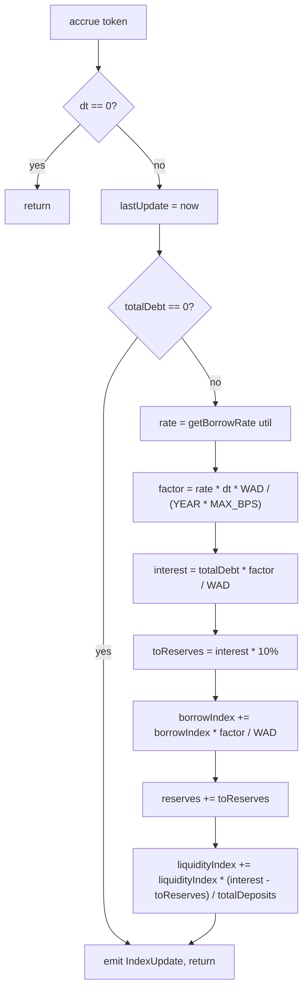

# Accounting

How `Desultory.sol` stores who owns what. Everything here is per-token; each
supported token has its own independent `Pool`.

## The problem this solves

Interest accrues continuously to every borrower and every lender. Touching every
position on every accrual would cost unbounded gas. The standard answer, which
this protocol uses, is to store balances *scaled* by a monotonically growing
index, so that growing one number grows everyone's balance at once.

## Two indexes

```solidity
struct Pool {
    uint256 liquidityIndex;      // starts at WAD, grows with lender yield
    uint256 borrowIndex;         // starts at WAD, grows with the borrow rate
    uint256 totalScaledDeposits;
    uint256 backstopScaledDeposits;  // the protocol's own deposit, a SUBSET of the line above
    uint256 totalScaledBorrows;
    uint256 reserves;            // protocol cut, in token units
    uint40  lastUpdate;
}
```

`WAD` is `1e18`. Both indexes start at `WAD` and only ever increase.

A position's real balance is always `scaled * index / WAD`:

- deposits: `__scaledDeposits[positionId][token] * liquidityIndex / WAD`
- debt: `__scaledBorrows[positionId][token] * borrowIndex / WAD`

Because `borrowIndex` grows faster than `liquidityIndex` (the difference is the
reserve cut), debt outgrows deposits — which is the entire economic point.

## Accrual

`accrue(token)` runs at the top of every state-changing function. It is the only
place either index changes.



Two things worth noting:

**No borrows means no accrual.** If `totalDebt == 0` the function returns early
after stamping `lastUpdate`. Idle time with no borrowers does not silently inflate
the indexes, so depositors earn nothing while nobody is borrowing. Correct, and
easy to get wrong.

**The reserve cut is taken before lenders.** `RESERVE_FACTOR` is `1_000` BPS = 10%.
Ten percent of accrued interest goes to `pool.reserves`; the remaining 90% grows
`liquidityIndex`. Reserves accumulate in token units, and two other paths feed the same
pot: the whole DUSD stability fee (see [[Cross-Chain]]) and `LIQ_PROTOCOL_SHARE` — 30% —
of every liquidation bonus (see [[Liquidations]]).

`pool.reserves` now has two outlets and two inlets.

`withdrawReserves(token, to, amount)` pays a pool's reserves out to the owner's chosen
recipient. It accrues first, so the figure it reads is settled rather than stale. It is
the **only** path by which cash leaves the contract as revenue.

It needs no liquidity gate, unlike `withdraw()` and `borrow()`. Those move deposits
against a fixed reserve backing, so they must stop at `getAvailableLiquidity`. A reserve
withdrawal drops the contract's balance and `pool.reserves` by the same amount, so both
sides of *cash = deposits + reserves − debt* fall together and depositors are untouched.

`_commitBackstop(token, want)` is the second outlet, and it moves no tokens. It converts
reserves into `pool.backstopScaledDeposits` — the protocol's own deposit, credited to
`totalScaledDeposits` alongside every lender's — so a backstopped liquidation can seize
against cash the availability view does not report. Only the split between "protocol
revenue" and "deposit base" changes, so the identity again holds by construction. The
credit rounds down per the policy below, and reserves fall by the exact round-trip of the
scaled figure so no dust drifts between the two lines. See [[Liquidations]].

`releaseBackstop(token, amount)` is the inlet on the same line: owner-gated, it accrues,
converts the protocol's deposit back into `pool.reserves` with the interest it earned, and
moves no tokens. Unlike `withdrawReserves` it **does** gate on `getAvailableLiquidity`,
because it lowers deposits against a fixed reserve backing exactly as `withdraw()` does.

Why the availability view needs the backstop at all: `getAvailableLiquidity` is
`max(0, deposits - debt)`, which by the identity above is `max(0, cash - reserves)`. It
therefore under-reports spendable cash by exactly `min(reserves, cash)` — and because
`borrowIndex` outgrows `liquidityIndex` by the reserve cut on every accrual, a pool
routinely sits with deposits below debt and reports zero available while holding real
cash.

**DUSD reserves are not withdrawable.** `dusdReserves` is a claim, not a balance:
`borrowDUSD` mints to the borrower and `repayDUSD` burns from the payer, so the protocol
never holds DUSD. Paying it out would mean minting unbacked supply. See
[[0005-treasury-withdrawal]].

## Rounding policy

Four helpers, and the choice between them is always the same rule: **round in the
pool's favor.**

| Helper | Rounds | Used for |
|---|---|---|
| `__toScaledDown` | down | crediting a deposit — user gets slightly less |
| `__toScaledUp` | up | recording a debt — user owes slightly more |
| `__fromScaledDown` | down | reading a deposit balance |
| `__fromScaledUp` | up | reading a debt balance |

The consequence is that round-tripping (deposit then immediately withdraw, or
borrow then immediately repay) can never return more than was put in. This is
asserted by fuzz tests `testFuzzDepositWithdrawNeverProfits` and
`testFuzzBorrowRepayNeverProfits`.

## The accrual leak (found and fixed)

`accrue()` used to charge borrowers and pay lenders from two different numbers.

It computed a notional figure, `interest = totalDebt * factor / WAD`, credited
`reserves` a tenth of it exactly, and grew `liquidityIndex` to hand lenders the other
nine tenths. But borrowers' debt does not grow by `interest` — it grows by whatever
`borrowIndex += borrowIndex * factor / WAD` produces. That truncation discards up to
one wei **of the index**, which is then multiplied by `totalScaledBorrows`. At ~1e23
scaled borrows, one truncated wei of index is roughly 1e5 wei of real debt that was
distributed but never charged.

Per accrual it is a coin flip on truncation direction; the losses accumulate because
nothing claws back the gains. The pool ends up owing more than it holds — rounding in
the wrong direction, against the policy above.

The fix charges borrowers first and distributes exactly what was charged:

```solidity
pool.borrowIndex += (pool.borrowIndex * factor) / WAD;
uint256 interest = __fromScaledUp(pool.totalScaledBorrows, pool.borrowIndex) - totalDebt;
```

`totalDebt` is now read with `__fromScaledUp`, matching `getUtilization` — which also
resolves a previously-documented inconsistency between the two.

Found by the Chimera harness, not by review: it had survived in working, tested code.
Reproduced in isolation by `test/recon/AccrualLeak.t.sol`. Note that the first accrual
from a pristine `borrowIndex == WAD` cannot leak, so only long, messy sequences
surface it. See [[Invariants]].

## Where the money physically is

All tokens sit in the `Desultory` contract itself. There are no per-position vaults.
`getAvailableLiquidity(token)` is what bounds withdrawals and borrows: you cannot
withdraw liquidity that has been lent out, even if your own deposit balance covers it.
That is what `Desultory__InsufficientLiquidity` means.

## Related

- [[Interest-Rate-Model]] — where the rate that drives `borrowIndex` comes from
- [[Positions]] — what a `positionId` is and who is allowed to use one
- [[Oracles]] — how balances become USD for the health check
- [[Liquidations]] — the backstop that commits reserves as a deposit, and releases them back
- [[0006-internal-liquidation-backstop]] — why reserves are converted rather than spent
