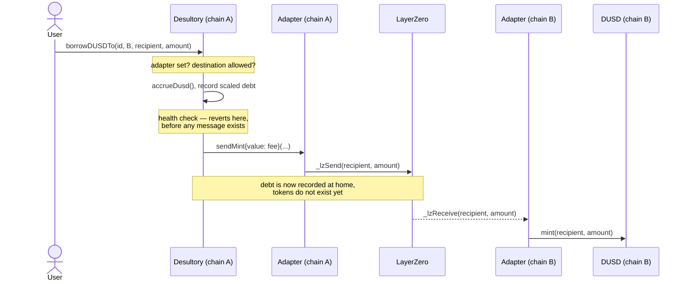

# Cross-Chain

How a position on one chain ends up holding DUSD on another. The reasoning behind this
shape is [[0003-dusd-only-cross-chain-borrowing]]; this note describes the mechanism.

The governing rule: **a position never leaves its home chain.** Its NFT, its collateral
and its debt all live there, so `isPositionHealthy` stays a local storage read and
liquidation never has to reach across a bridge. Only DUSD moves.

## The pieces

| Contract | File | Role |
|---|---|---|
| `Desultory` | `src/Desultory.sol` | records DUSD debt, checks health, pays the Adapter |
| `Adapter` | `src/crosschain/Adapter.sol` | LayerZero V2 OApp; carries mint authorizations |
| `DUSD` | `src/DUSD.sol` | LayerZero V2 OFT; the borrowable asset, with gated minting |

`Adapter` is symmetric — the same contract is deployed on every chain and both sends and
receives. A chain is a *home* chain for positions opened there and a *destination* chain
for DUSD minted there; most chains are both.

## The four flows

**1. Borrow at home** — `borrowDUSD(positionId, amount)`. Records debt, mints locally.
No message.

**2. Borrow onto another chain** — `borrowDUSDTo(positionId, dstEid, recipient, amount, options)`.



**3. Repay at home** — `repayDUSD(positionId, amount)`. Burns the payer's DUSD, retires
the debt. Permissionless, like `repay`: settling someone's debt only helps them.

**4. Repay from elsewhere** — no protocol message. DUSD is an OFT, so the borrower
bridges their own tokens home with `DUSD.send()` (burn on the far side, mint at home) and
then calls `repayDUSD` locally. The protocol never learns a bridge happened. This is the
main thing the DUSD-only decision buys.

## The receive path may never revert

`Adapter._lzReceive` decodes `(address recipient, uint256 amount)` and mints. That is all
it does, and that is the entire safety argument for the optimistic design:

> By the time `_lzReceive` runs, the debt is already recorded on the source chain.
> LayerZero persists undelivered messages and retry is permissionless, so a *transient*
> failure self-heals. A *permanent* revert strands the message and leaves the borrower
> owing DUSD they never received.

So: no pause flag, no allowlist, no supply cap, no balance check, no `require`. Every
check that can reject a borrow lives on the send side, in `borrowDUSDTo`, where reverting
costs the user nothing but gas. Nothing failable may ever be added to the receive path.

## DUSD debt accounting

DUSD debt is stored separately from `__pools` and is never an entry in `__tokenList`.
It has no liquidity side, no utilization and no lender share:

```solidity
uint256 public dusdBorrowIndex;      // starts at WAD
uint256 public totalScaledDusdDebt;
uint256 public dusdReserves;
mapping(uint256 position => uint256 scaled) private __scaledDusdDebt;
```

`accrueDusd()` applies a **flat** annual stability fee, `dusdStabilityFeeBps` (default
2%, capped at 100%). Flat rather than the kinked curve of
[[Interest-Rate-Model]] because `getUtilization` is `debt / deposits` and nobody deposits
DUSD — utilization would be permanently zero, so the curve would return the base rate no
matter how much is outstanding.

The **entire** fee goes to `dusdReserves`. There are no DUSD depositors to share it with.

It follows the charge-first discipline from [[Accounting]] — grow the index, then derive
what was charged from the index, and distribute exactly that:

```solidity
dusdBorrowIndex += (dusdBorrowIndex * factor) / WAD;
uint256 charged = __fromScaledUp(totalScaledDusdDebt, dusdBorrowIndex) - totalDebt;
dusdReserves += charged;
```

Rounding matches the rest of the protocol: borrowing scales **up**, repaying scales
**down**. Both favor the pool.

### DUSD debt counts toward health

`userBorrowedAmountUSD` adds `getPositionDusdDebt(position)` to its per-token loop. Every
LTV check, `isPositionHealthy`, and the `Position._update` transfer gate read through that
one function, so all of them see DUSD debt. Without it a position could mint DUSD without
ever appearing encumbered.

### The $1 valuation gap

DUSD debt is added to `userBorrowedAmountUSD` **at par**. This is an assumption, not a
fact. It holds only while the peg holds, and the peg mechanism is not designed yet
(project C2). If DUSD trades above $1, debt is understated here and positions are
under-collateralized in real terms. This is a known, documented hole, not an oversight.

## Configuration surface

Owner-only, on `Desultory`:

| Setter | Effect |
|---|---|
| `setAdapter(address)` | the Adapter permitted to be paid for mint authorizations |
| `setAllowedDestination(uint32 eid, bool)` | destination chains a position may mint to |
| `setDusdStabilityFee(uint16 bps)` | accrues at the old rate first, then repoints |

Owner-only, elsewhere: `Adapter.setDesultory`, `Adapter.setPeer` (from `OAppCore`),
`DUSD.setMinter`.

`script/Deploy.s.sol` deploys the Adapter and wires it to `Desultory` and `DUSD`, but sets
**no peers and no allowed destinations** — those are per-deployment configuration, and a
single-chain local deploy has no peer.

## Trust boundary

**A compromised Adapter on any configured chain can mint unlimited DUSD, spendable on
every chain.** Peer configuration is the entire security boundary. There is deliberately
no second line of defence on the receive side, because any such check could permanently
strand a message.

Concretely, the chain of trust is: `Desultory` pays only the configured `adapter` →
`Adapter.sendMint` accepts only `desultory` → `_lzReceive` accepts only a configured peer
(enforced by `OAppReceiver`) → `DUSD.mint` accepts only a configured minter.

## Tests

- `test/crosschain/Adapter.t.sol` — messaging in isolation, on `TestHelperOz5` with two
  endpoints. Includes `test_receiveIsUnconditional`, which mints for a recipient with no
  position and no history.
- `test/crosschain/CrossChainBorrow.t.sol` — the full flow: deposit on A, DUSD on B,
  over-LTV and disallowed-destination reverts *before* any message is sent, and the
  bridge-home-then-repay round trip.
- `test/recon/` — the Chimera harness drives `borrowDUSD`/`repayDUSD` and asserts two
  DUSD properties; see [[Invariants]].

## Related

- [[0003-dusd-only-cross-chain-borrowing]] — why this shape
- [[Accounting]] — the index model `accrueDusd` follows
- [[Positions]] — the NFT that never leaves home
- [[Liquidations]] — broken; this design is what lets its rewrite stay single-chain
