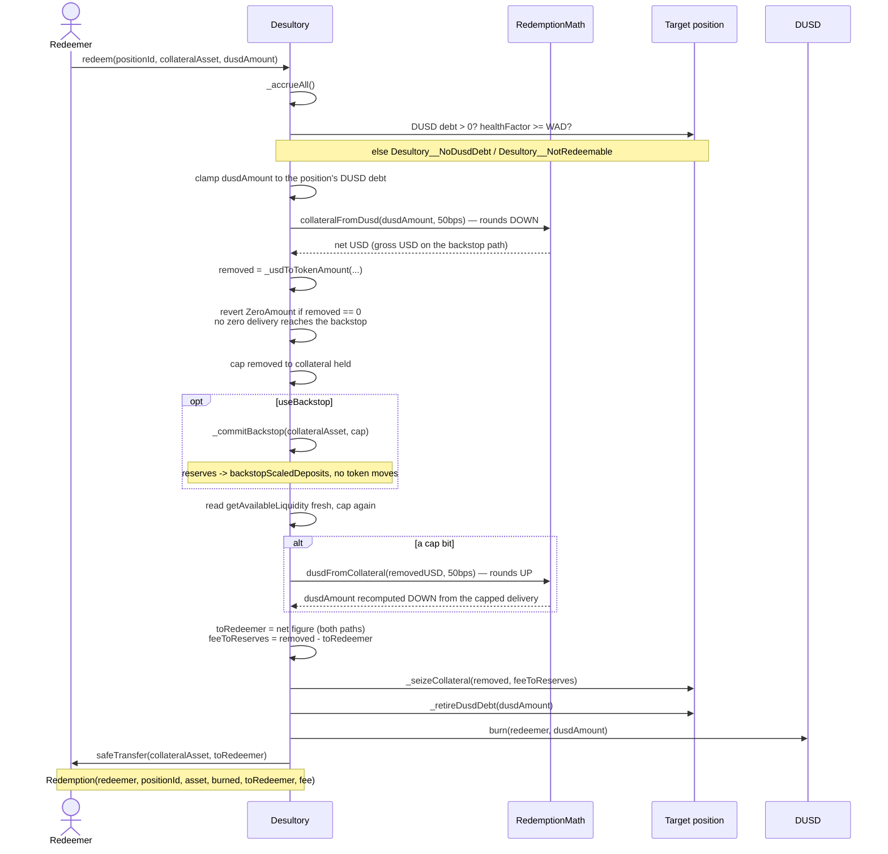

# DUSD

The protocol's own stablecoin, and the only asset that crosses chains. This note is its
whole lifecycle in one place: where units come from, where they go, what the $1 in
`userBorrowedAmountUSD` rests on, and what is still open. The mechanism of the bridge
itself is [[Cross-Chain]]; the reasoning behind the shape is
[[0003-dusd-only-cross-chain-borrowing]] and [[0007-dusd-redemption]].

## What it is

`src/DUSD.sol` — 46 lines. A LayerZero V2 **OFT** with an owner-managed `isMinter`
allowlist gating `mint` and `burn`. That is the entire contract. Being an OFT is
load-bearing twice over: it lets a borrower bridge their own DUSD home and repay there
with no protocol message involved, and it means a redeemer on any chain can acquire DUSD
wherever it is cheap and bring it to a position's home chain.

In a normal deployment the minters are `Desultory` (local borrows, repayments,
redemptions) and `Adapter` (mints authorized from another chain).

## The supply lifecycle

Three things move DUSD supply, and exactly three:

| Event | Supply | Debt | Collateral |
|---|---|---|---|
| `borrowDUSD` / `borrowDUSDTo` | **+** mint | **+** recorded at home | untouched |
| `repayDUSD` | **−** burn from the payer | **−** retired | untouched |
| `redeem` / `redeemWithBackstop` | **−** burn from the redeemer | **−** retired, at par | **−** leaves the position |

The first two are symmetric and voluntary: the borrower creates the liability and the
borrower settles it. The third is neither — a **third party** retires someone else's debt
and takes collateral for doing it. That asymmetry is what earns DUSD its own note, and it
is the entire peg mechanism.

Debt is stored scaled, outside `__pools`, and DUSD is never an entry in `__tokenList`:

```solidity
uint256 public dusdBorrowIndex;      // starts at WAD
uint256 public totalScaledDusdDebt;
uint256 public dusdReserves;
mapping(uint256 position => uint256 scaled) private __scaledDusdDebt;
```

Both retirement paths — `repayDUSD` and `_redeem` — go through the **same** private
helper, `_retireDusdDebt(positionId, amount)`, which scales down (crediting no more relief
than the payment warrants) and clamps to the position's stored scaled debt. It was
extracted from `repayDUSD` when redemption was added rather than copied, which is what
makes `property_dusdDebtReconciles` hold by construction instead of by two implementations
agreeing. See [[Invariants]].

## The stability fee

`accrueDusd()` applies a **flat** annual `dusdStabilityFeeBps` (default 2%, capped at
100%), not the kinked curve of [[Interest-Rate-Model]]. `getUtilization` is
`debt / deposits` and nobody deposits DUSD, so utilization would be pinned at zero and the
curve would return the base rate no matter how much DUSD was outstanding.

The **entire** fee goes to `dusdReserves`. There are no DUSD depositors to share it with.
It follows the charge-first discipline from [[Accounting]] — grow the index, derive what
was charged from the index, distribute exactly that:

```solidity
dusdBorrowIndex += (dusdBorrowIndex * factor) / WAD;
uint256 charged = __fromScaledUp(totalScaledDusdDebt, dusdBorrowIndex) - totalDebt;
dusdReserves += charged;
```

## The par convention, and what now justifies it

`userBorrowedAmountUSD` adds `getPositionDusdDebt(position)` to its per-token loop **at
$1**, with no oracle. Every LTV check, `healthFactor`, `isPositionHealthy` and the
`Position._update` transfer gate read through that one function, so all of them inherit
the convention — including the liquidation trigger.

Until redemption existed this was an admission: a documented hole, tracked as project C2.
It now rests on a mechanism. A DUSD holder can always convert a unit into $1 of collateral
less the fee, so below `$0.995` buying DUSD and redeeming it returns more than it cost,
and each such trade burns supply until the discount closes. Arbitrage enforces par rather
than the contract assuming it. The valuation code is unchanged and deliberately so — see
[[0007-dusd-redemption]] decision 1.

**What this does and does not buy.** It is a floor, not a band. Nothing caps DUSD above
$1, which is the direction that *understates* debt and lets an under-collateralized
position read as healthy. Supply caps (C2.2) are the other half and are not built.

## Redemption

```solidity
redeem(uint256 positionId, address collateralAsset, uint256 dusdAmount)
redeemWithBackstop(uint256 positionId, address collateralAsset, uint256 dusdAmount)
```

Thin `nonReentrant` wrappers over `_redeem(..., bool useBackstop)`. `nonReentrant` sits on
the wrappers and never on the private implementation, so the two cannot be composed into a
re-entrant path — the same arrangement [[Liquidations]] uses.

The caller names the target, exactly as `liquidate` does. **The gate is the inverse of
liquidation's**: `redeem` requires `healthFactor >= WAD` and reverts with
`Desultory__NotRedeemable` below it. Healthy positions are redeemable and are always
improved by a redemption; unhealthy ones are liquidatable and belong to the other engine.
The derivation of why `WAD` is the right line — the improvement boundary is
`HF > threshold × (1 − fee)`, at most 0.8955 at the shipped parameters — is in
[[0007-dusd-redemption]] decision 2.

`REDEMPTION_FEE_BPS = 50` (0.5%) is never a separate transfer. It is the **difference**
between the DUSD burned and the collateral paid out, which is why it cannot be skipped or
double-counted, and it is what makes the mechanism self-activating: profitable only below
$0.995, so dormant rather than disabled in calm markets.

### The flow



### Where the fee lands

| Path | Leaves the position | Redeemer receives | The `D·f` remainder |
|---|---|---|---|
| `redeem` | `D·(1−f)` (net) | `D·(1−f)` | stays with the position, as collateral it no longer owes debt against |
| `redeemWithBackstop` | `D` (gross) | `D·(1−f)` | booked to `pool.reserves` by `_seizeCollateral` |

The redeemer's take is the net figure on **both** paths, so the arbitrage threshold stays
a single number a bot can hold in its head rather than something computed per position and
per pool. What differs is who keeps the fee, and the rule is the one
[[0006-internal-liquidation-backstop]] set for the liquidation bonus: whoever carried the
risk is paid. On the backstopped path the protocol converted its own reserves to make the
fill possible, so the protocol keeps it.

Because the borrower is the party whose outcome differs between the two, `redeemWithBackstop`
is a **separate entry point and never an automatic fallback**. Against a saturated pool,
`redeem` takes the `Desultory__ZeroAmount` revert instead of escalating.

A redemption too small to move any collateral takes that same revert on **both** paths.
`removed` is checked against zero before `_commitBackstop` is reached, so a dust
`redeemWithBackstop` cannot convert reserves into `backstopScaledDeposits` — capital
`releaseBackstop` cannot return while the pool stays saturated — in exchange for a
delivery of nothing. See [[Liquidations]] on the commit's rounding seam.

### The arithmetic

`src/libraries/RedemptionMath.sol` — two pure, unit-agnostic functions, deliberately
adjacent because they are an inverse pair and a disagreeing inverse pair is the defect
class [[0004-liquidation-engine]] catalogues:

- `collateralFromDusd(dusdAmount, feeBps)` rounds **down** — the redeemer never receives
  more than the fee schedule warrants.
- `dusdFromCollateral(collateralUSD, feeBps)` rounds **up** — the inverse is only ever used
  to recompute a *capped* figure downward, and rounding down there would hand out a sliver
  of free collateral on every partial fill.

Both directions favour the pool, per [[Accounting]]'s rounding policy.

## `dusdReserves`: a claim, not a balance

The stability fee accumulates in `dusdReserves` and **cannot be withdrawn**. The protocol
never custodies a single DUSD: `borrowDUSD` mints to the borrower, `repayDUSD` burns from
the payer, and redemption burns from the redeemer. The fee raises what borrowers owe, and
they settle it by acquiring DUSD from circulation and burning it — no tokens ever arrive
here. "Withdrawing" it would mean **minting new DUSD against no new collateral**. See
[[0005-treasury-withdrawal]].

Redemption changes the shape of that objection without removing it. There is now a route
from DUSD to collateral, so the claim is no longer denominated in a unit with no floor —
but minting unbacked supply now dilutes *redemption backing* rather than nothing at all,
which is a sharper reason to refuse, not a weaker one. It stays C2.3's question, and C2.3
is open.

Token reserves in `pool.reserves` are a different thing entirely and do leave, through
`withdrawReserves`. See [[Accounting]].

## What is still open

- **Supply caps (C2.2).** Nothing bounds how much DUSD can be minted, per position, per
  chain or globally. Redemption floors the price; nothing ceilings the supply.
- **The `dusdReserves` outlet (C2.3).** Above. Unblocked in principle, not decided.
- **No ceiling mechanism.** Redemption is one-sided. DUSD above $1 is still the direction
  that understates debt, and the only force against it is a borrower's incentive to mint
  and sell.
- **Cross-chain liquidation and redemption.** Both engines are single-chain: they act on a
  position at its home chain. DUSD acquired anywhere can be brought home to redeem, but the
  call itself happens where the position lives. See [[Cross-Chain]].

## Tests

- `test/RedemptionMath.t.sol` — the fee pair in isolation, including
  `testFuzzRoundTripNeverFavorsTheRedeemer`.
- `test/Desultory.t.sol` — eleven redemption tests: the happy path, the fee staying with
  the position, the health-factor improvement, the unhealthy-position revert and its
  liquidatable counterpart, the no-DUSD-debt revert, the clamp to outstanding debt, and
  four covering the backstopped path (ordinary redeem cannot fill against a saturated
  pool, the backstopped one can, the fee lands in reserves, custody holds).
- `test/recon/` — `desultory_redeem` and `desultory_redeemWithBackstop` on the fuzzing
  surface, with an in-target assertion. Read [[Invariants]] before trusting the counts:
  the backstopped target fired **zero** times in 300,000 calls.

## Related

- [[Cross-Chain]] — the bridge, the adapter trust boundary, and the receive path
- [[Accounting]] — the index model, the rounding policy, and `pool.reserves`
- [[Liquidations]] — the engine redemption partitions the book with, and the shared backstop
- [[Invariants]] — what the harness asserts about the DUSD supply and the redemption path
- [[0003-dusd-only-cross-chain-borrowing]] — why DUSD exists and why only it crosses chains
- [[0005-treasury-withdrawal]] — why `dusdReserves` is not withdrawable
- [[0007-dusd-redemption]] — the reasoning behind redemption's gate, fee and entry points
