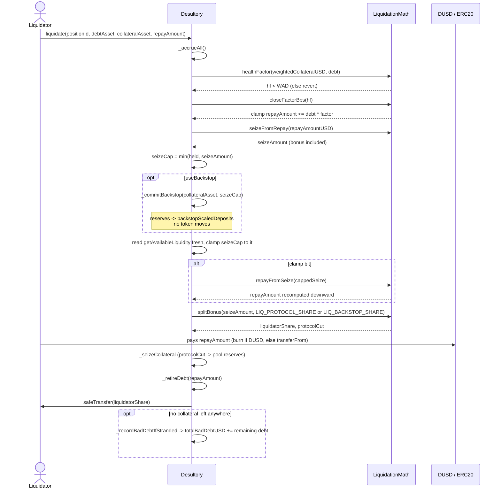

# Liquidations

The old dual-entry-point engine (`liquidateAssetPosition`/`liquidateProportionalPosition`,
all seven defects catalogued below under "History") has been replaced. The current
engine is a single private implementation behind two external entry points:

```solidity
liquidate(uint256 positionId, address debtAsset, address collateralAsset, uint256 repayAmount)
liquidateWithBackstop(uint256 positionId, address debtAsset, address collateralAsset, uint256 repayAmount)
```

Both are thin wrappers over
`_liquidate(positionId, debtAsset, collateralAsset, repayAmount, bool useBackstop)`, and
`useBackstop` changes exactly two things: the seizure cap may draw on protocol reserves
converted into a protocol-owned deposit (see "Internal backstop" below), and the bonus
split uses `LIQ_BACKSTOP_SHARE` (70% to the protocol) instead of `LIQ_PROTOCOL_SHARE`
(30%) — the protocol keeps more because it is now the one carrying the pool's liquidity
risk. `nonReentrant` sits on the two wrappers and never on `_liquidate`, so they cannot be
composed into a re-entrant path.

A liquidator must pick the backstop entry point deliberately; `liquidate()` never
escalates into it. Nobody who quoted their profit off the ordinary 30% split is silently
paid the 70% one. The larger share comes out of the **liquidator's** bonus and is never
charged to the position: the borrower gives up the same seizure either way, so
`seizeFromRepay`, `healthFactor` and the close factor are all untouched.

## Flow

1. **Accrue everything** (`_accrueAll`), then require `healthFactor(positionId) < WAD`
   (see [[Positions]] for what `healthFactor` means and how it differs from the LTV cap).
2. Resolve `debt`, the position's outstanding debt in `debtAsset` — DUSD or any
   whitelisted pool token (`_debtInAsset`).
3. **Close factor**: `repayAmount` is clamped down (never reverted) to
   `debt * LiquidationMath.closeFactorBps(hf) / MAX_BPS`. Clamping instead of reverting
   means a liquidator bot that loses a race for a *fully* liquidatable position still
   gets a partial fill instead of burning a transaction.
4. **Seizure**: convert the (possibly clamped) `repayAmount` to a USD figure
   (`_debtValueUSD` — DUSD is valued at par, since it has no `__tokenInfos` entry and
   thus no price feed; every other debt asset goes through the oracle), run it through
   `LiquidationMath.seizeFromRepay` (adds the liquidation bonus), and convert to a
   collateral-token amount (`_usdToTokenAmount`).
5. **Clamp to what's actually held, and back-solve.** If the position doesn't hold that
   much of `collateralAsset`, seizure is capped at `getPositionCollateralForToken`, and
   `repayAmount` is **recomputed downward** from the capped seizure
   (`LiquidationMath.repayFromSeize` + `_debtAmountFromUSD`, the exact inverse of step 4,
   using the same DUSD-at-par convention), then re-clamped to `debt` in case rounding
   pushes it back over. Skipping this step and charging the original `repayAmount` for a
   short delivery would be the same class of bug as defect 1 below (wrong-token payout) —
   just harder to see, because both sides are still denominated correctly.
6. **Bonus split**: `LiquidationMath.splitBonus` divides the seize amount between the
   liquidator and the protocol (`LIQ_PROTOCOL_SHARE`, 30% of the bonus lands in
   `pool.reserves` — or `LIQ_BACKSTOP_SHARE`, 70%, on the backstop path).
7. **Effects**: `_seizeCollateral` removes the seized collateral and books the protocol
   cut; `_retireDebt` reduces the position's debt by exactly `repayAmount`.
8. **Interaction**: `safeTransfer` sends the liquidator's share of seized collateral
   from the contract's own balance — value only ever moves by the liquidator's implicit
   payment (their debt-asset tokens, taken via `_retireDebt`) against protocol-held
   collateral, never a `transferFrom`-then-fallback-to-protocol-funds pattern.
9. **Bad debt sweep** (`_recordBadDebtIfStranded`): if the position now holds zero
   collateral **of every kind** (`userCollateralValueUSD == 0`, not just the asset just
   seized — a position with WETH gone but USDC remaining is still liquidatable by
   someone else) and debt remains, that remaining debt is added to `totalBadDebtUSD`
   and a `BadDebtRecorded(positionId, amountUSD)` event fires.



## Internal backstop

`getAvailableLiquidity(token)` returns `max(0, deposits - debt)`. Substituting the custody
identity `cash = deposits + reserves - debt` gives `available = max(0, cash - reserves)`:
the figure the seizure clamps against under-reports the pool's real spendable cash by
exactly `min(reserves, cash)`, and that quantity is the backstop's entire budget.

A pool whose deposits sit below its debt reports zero available while still holding real
cash, and that is the **normal** post-accrual state — `borrowIndex` grows faster than
`liquidityIndex` by at least the reserve cut on every accrual (see [[Accounting]]). The
pool does not have to be drained for this to bite.

**This mechanism is no longer liquidation's alone.** `_commitBackstop` has a second
caller: `redeemWithBackstop` funds a DUSD redemption against a cash-poor pool through
exactly the same path, sized to the collateral the redemption may remove. Everything
described below — the sizing off raw figures, the down-rounded credit, the no-token-moves
custody argument, `releaseBackstop` as the only way back — applies identically on that
path. Read this section as "the internal backstop", not "the liquidation backstop". See
[[DUSD]] and [[0007-dusd-redemption]].

`_commitBackstop(token, want)` converts reserves into a protocol-owned deposit so a
seizure of up to `want` can proceed:

1. Read `deposits` and `debt` from the **raw** scaled figures (`__fromScaledDown` on
   deposits, `__fromScaledUp` on borrows) — deliberately not `getAvailableLiquidity`,
   which is already clamped to zero in exactly this state and would under-commit by the
   whole deficit, leaving the backstop to do nothing.
2. `need = (debt + want) - deposits`, returning early if deposits already cover it, then
   clamped to `pool.reserves` when reserves cannot cover the full shortfall.
3. Convert `need` to a scaled credit rounding **down**, the direction `deposit()` uses, so
   the protocol never receives more deposit claim than it paid for. Decrement
   `pool.reserves` by the exact round-trip of that scaled figure rather than by `need` —
   the truncated remainder stays in reserves — and credit both
   `pool.backstopScaledDeposits` and `pool.totalScaledDeposits`. Emits
   `BackstopCommitted(token, committed)`. That round-trip is exact for the scaled figure
   but not for the pool's *deposits* figure; see Known limitations below.

**No token moves.** Reserves were already cash sitting in the contract; only the split
between "protocol revenue" and "deposit base" changes, so both sides of
`cash = deposits + reserves - debt` move together and `property_custodyReconciles` is
preserved by construction rather than by a check — the same argument
[[0005-treasury-withdrawal]] makes for `withdrawReserves`.

Ordering inside `_liquidate` matters twice. The commit runs **after** `seizeCap` is
clamped to both the position's actual collateral and the requested seize amount, so the
commit is sized to the seizure that can actually happen rather than to the one that was
requested — reserves are never converted to unlock liquidity for collateral that is not
there. Read this as a bound on *how much* is committed, not as a guard against committing
at all: a position holding 5 WETH against a 50 WETH-equivalent seize in a short WETH pool
still triggers a commit, sized to the 5 WETH that can actually be taken. Only the
oversized figure is kept out. It runs
**before** `getAvailableLiquidity` is read for the final clamp, and that availability is
re-read fresh rather than incremented by an assumed amount, because the down-rounded
credit can land a wei short of what was asked for. A pool with no reserves commits
nothing and `liquidateWithBackstop` then behaves exactly like `liquidate()`, including
the same `Desultory__ZeroAmount` revert on a zero fill.

`_redeem` orders its own commit for the same two reasons: after the cap is clamped to the
collateral the position actually holds, and before `getAvailableLiquidity` is re-read
fresh.

`pool.backstopScaledDeposits` is a **subset** of `pool.totalScaledDeposits`, never a
parallel figure. It is deliberately not a position, so `withdraw()` — which keys off
`__scaledDeposits[positionId][token]` behind `onlyPositionOwner` — cannot reach protocol
capital.

### Releasing it

`releaseBackstop(token, amount)` is owner-gated and is the mirror. It accrues first, so
the interest the deposit earned through `liquidityIndex` is realized rather than
stranded; mirrors `withdraw()`'s shape exactly (full-balance shortcut, `__toScaledUp` for
the partial case, clamp, then the gate); and converts the deposit back into
`pool.reserves`. It emits `BackstopReleased(token, amount)` and moves no tokens either, so
cash still leaves the contract through exactly one door — the pre-existing
`withdrawReserves`.

It gates on `getAvailableLiquidity` precisely where `withdrawReserves` does not, and the
asymmetry is the point. `withdrawReserves` lowers the balance and `pool.reserves`
together, so custody holds by construction. `releaseBackstop` lowers deposits against a
fixed reserve backing — exactly what `withdraw()` does — so it gets exactly the gate
`withdraw()` gets.

### What it costs

The protocol becomes a lender in a pool it cannot withdraw from until utilization falls.
That liquidity risk is the real cost of the backstop and is what the larger bonus share
pays for. The capital is not lost — it earns the index like any other deposit — but it is
illiquid, and a pool that stays saturated keeps it illiquid indefinitely.

The liquidator still clears a profit, which is what makes the path usable at all: at
`LIQ_BACKSTOP_SHARE` (7000bps of the bonus to the protocol) the liquidator keeps 30% of
the bonus, so against WETH's 1000bps bonus that is about +3%, and against USDC's 500bps
about +1.5%. Thin, deliberately — this is a last resort, not the default trade. See
[[0006-internal-liquidation-backstop]].

## Bad debt: counted, never socialized

`totalBadDebtUSD` is a monotone counter of *recognized* loss, snapshotted in USD at the
moment collateral ran out — it does not track prices afterward and is never decremented,
including if the position is later topped up. There is deliberately **no `liquidityIndex`
writedown** anywhere in this path: haircutting lenders' index would break
`property_indexesNeverDecrease` (see [[Accounting]] and the Chimera fuzzing harness).
A real loss-allocation policy (socializing bad debt across lenders, an insurance fund,
etc.) is out of scope for this project.

## Settled design points

- **Close factor** — `LiquidationMath.closeFactorBps(healthFactor)`, a partial-fill clamp.
- **Bonus, and who pays it** — a genuine bonus (not the old penalty-on-liquidator
  inversion), funded by extra collateral seized beyond the repaid value, split 70/30
  liquidator/protocol via `LIQ_PROTOCOL_SHARE`.
- **Health factor with a threshold above LTV** — `healthFactor` is
  threshold-weighted and distinct from the LTV-weighted borrow cap; see [[Positions]].
- **Accrual ordering** — `_accrueAll()` runs before `healthFactor`/`debt` are read.
- **Value movement** — collateral leaves the contract's own balance to the liquidator;
  the liquidator's payment is taken via `_retireDebt`, never a balance-sniff-then-fallback.
- **Bad debt** — recognized and counted (`totalBadDebtUSD`), never socialized onto
  lenders via the index.
- **Redemption is the other half of the book.** `redeem` requires
  `healthFactor >= WAD`, the exact inverse of this engine's gate, so a position is
  liquidatable or redeemable and never both. See [[DUSD]] and [[0007-dusd-redemption]].
- **Internal backstop** — `liquidateWithBackstop` as a separate, opt-in entry point;
  reserves converted into a protocol-owned deposit rather than spent; the larger
  `LIQ_BACKSTOP_SHARE` taken out of the liquidator's bonus rather than charged to the
  position; `releaseBackstop` returning capital to reserves so `withdrawReserves` stays
  the single exit. See [[0006-internal-liquidation-backstop]].
- **Cross-chain** — **still unsettled.** Liquidation is single-chain only; a position
  whose collateral and debt sit on different chains has no engine yet. See [[Cross-Chain]].

## Known limitations

- **A cash-poor pool can still fail a liquidation — now only when it is genuinely
  cash-poor.** The old framing of this limitation said `safeTransfer` reverts. It does
  not get that far: the availability clamp bites first, `repayAmount` is back-solved down
  from the tighter cap, and the call reverts with `Desultory__ZeroAmount`. The failure is
  a **zero fill**, not a failed transfer. `liquidateWithBackstop` (above) closes the case
  where the pool holds real cash that `getAvailableLiquidity` simply does not report. It
  does nothing for a pool with no reserves and no spare liquidity — that needs outside
  capital, which is the external (flash-loan) half of D2 and has no spec yet.
- **`totalBadDebtUSD` is a snapshot, not a live mark.** It is credited once, in USD, at
  the moment a position's collateral hits zero across every asset. It is never
  decremented, and it does not track price movement afterward — a later price recovery
  (or a position top-up) does not reduce it. It is a *recognized-loss counter*, not a
  running mark of protocol insolvency. It can also **over-count**: `deposit()` is
  permissionless, so anyone may re-collateralize a stranded position, and if that
  position strands again later, the same underlying debt is credited to
  `totalBadDebtUSD` a second time — there is no recognition-flag tracking which debt
  has already been counted. The counter is therefore one-directional noise in both
  senses: it can under-state loss (stale USD snapshot, no price tracking) and
  over-state it (repeat stranding of a topped-up position), never an exact live figure.
- **Seizure is bounded by pool liquidity — a bug this harness caught.** The clamp in
  `liquidate()` caps `seizeAmount` at the lesser of the position's collateral held and
  `getAvailableLiquidity(collateralAsset)`, the same bound `withdraw()`/`borrow()`
  already apply. This was **not** in the original design — `_seizeCollateral`
  originally decremented `totalScaledDeposits` with no liquidity gate at all, and
  Medusa failed `property_borrowIndexOutpacesLiquidityIndex` after ~98k calls once
  `liquidate` entered the target surface. Root cause: `accrue()` grows
  `liquidityIndex` faster than `borrowIndex` whenever `0.9 × totalDebt > totalDeposits`,
  a state `withdraw`/`borrow` could never reach but unbounded seizure could. This is
  the **second** real bug this harness has caught, after the `accrue()` interest leak
  documented in [[Accounting]]. See
  `test/Desultory.t.sol:testSeizureIsBoundedByAvailableLiquidity` and
  `.superpowers/sdd/2026-09-12-liquidation-engine/task-7-report.md`.
- **A wei-scale rounding seam remains, deliberately unfixed — and the backstop widens
  it.** The availability bound above is computed in token units, but `_seizeCollateral`
  converts the decrement with `__toScaledUp` (rounds up), so a seizure that exactly
  saturates the cap can leave a pool's deposits 1–2 wei below its debt. It was parked
  rather than patched with an unexplained `-1` safety margin.

  The design spec for the backstop claimed it *inherits, does not widen* this seam. **That
  claim was wrong.** On the ordinary path the cap binds only sometimes, and binds exactly
  only rarely. On the backstop path `seizeCap` is set to precisely the availability the
  commit just unlocked, so the precondition holds on **every** call — what is an edge case
  on the ordinary path is routine here. `_commitBackstop`'s own down-rounding adds a
  second floor in the same direction, bounded by `liquidityIndex / WAD`. Observed in
  testing: a deterministic **2-wei shortfall** against a ~449,740-token pool.

  It is still not worth patching, and nothing it can reach cares — but the argument for
  that had to be restated, because the version it used to rest on ("invariant 3 needs
  roughly a 10% deficit, not a couple of wei") is false as a general claim. ADR 0008
  inverted the indexes at a **zero** deficit. See "Superseded framings" below.

  Restated against what invariant 3 actually rests on, the seam survives.
  `accrue()` credits lenders only when `interest > 0`, which requires `borrowIndex` to
  have moved first; the ceiling cut then withholds at least 1 wei, so the lender side
  receives at most `interest - 1` spread over a deposit base that ceilings rather than
  floors. Against a ~449,740-token pool a 2-wei gap is ~4e-12 in relative terms, inside
  that headroom by twelve orders of magnitude. What the restatement costs is generality:
  the argument is now explicitly about the gap's size *relative to the pool*, not about
  2 wei being small in absolute terms, so it does not carry to a dust-scale pool where a
  couple of wei is the whole base. That regime is held by ADR 0008's two roundings, not
  by this paragraph. `property_utilizationNeverExceeds100` holds because `getUtilization`
  clamps at `MAX_BPS`. `property_custodyReconciles` is a `gte` whose right-hand side the shortfall
  moves *down*, so the rounding runs in the property's favour. Accordingly
  `test/Desultory.t.sol:testBackstopLeavesDepositsCoveringDebtWithinRoundingDust` asserts
  the shortfall is dust (≤ 10 wei) rather than zero, and says why. Invisible to every
  existing invariant; economically meaningless; real; and routine rather than rare on one
  of the two paths.
- **A commit can move custody's right-hand side up by 1 wei.** `_commitBackstop`
  decrements `pool.reserves` by the exact round-trip of the scaled credit, which is exact
  for that scaled figure — but not for the pool's deposits figure. Deposits read as
  `floor((T + scaled) * i / WAD)`, and `floor(x + y)` can exceed `floor(x) + floor(y)`, so
  deposits can rise by `committed + 1` while `pool.reserves` falls by exactly `committed`.
  `property_custodyReconciles` is `balance + borrows >= deposits + reserves`, so its
  right-hand side can gain up to **1 wei per commit** with nothing on the left to match.
  This is the one rounding direction on the whole backstop path that runs *against* the
  pool rather than for it. It is acceptable because the bound is tight — at most 1 wei
  per commit — and because the pool's own cash is untouched either way.

  The bound used to carry a second argument: that every commit costs a real liquidation,
  so there is no way to grind it. That argument no longer holds. `redeemWithBackstop`
  reaches `_commitBackstop` against a **healthy** position, so a commit is now cheap and
  permissionless. `_redeem` rejects a redemption that would deliver zero collateral
  (`removed == 0`) before the commit can fire, which closes the free case; a redemption
  that does deliver still commits against the pool's whole deficit rather than against
  what it removes.

  `releaseBackstop` is safe under the same analysis, and the contrast is worth writing
  down: its `scaledAmount` rounds **up**, so deposits fall by at least `amount` while
  `pool.reserves` rises by exactly `amount`. The property's right-hand side is
  non-increasing across a release.

## Superseded framings

Accepted ADRs are never edited, so two of them still carry a justification this note no
longer accepts. Recorded here rather than by touching them:

- [[0004-liquidation-engine]] describes the wei-scale seizure seam as unreachable by a
  property "that needs roughly a 10% deficit".
- [[0006-internal-liquidation-backstop]] repeats the same figure when arguing the
  widened seam is invisible to `property_borrowIndexOutpacesLiquidityIndex`.

Both are **superseded by [[0008-reserve-cut-rounds-up]]**, whose second reproduction
inverted the two indexes at `deposits == debt == 3` scaled — a zero deficit — on rounding
alone. A deficit threshold was never what the property rested on. The conclusions those
two ADRs reach about the seam still stand; only the reason does. Read the restated
version under Known limitations above.

## History: the seven defects of the old engine

Kept for context — none of this code exists anymore, but the defects shaped which
invariants the rewrite had to hold.

1. **Paid the liquidator in the wrong token.** `settleDebtSeizeCollateral` transferred
   `tokenToRepay` using an amount denominated in `tokenToLiquidate` — different assets,
   different prices, different decimals.
2. **Seizure unbounded by debt size.** Took 90% of the position's entire balance of a
   collateral token regardless of debt size; no close factor.
3. **Penalty pointed the wrong way** — a haircut on the liquidator instead of a bonus.
4. **Proportional math always rounded to zero** (`valueUSD / totalUSD` in integer
   arithmetic before the numerator was scaled up).
5. **Liquidator intent inferred from `balanceOf(msg.sender)`**, falling back to
   protocol funds when the balance check failed — silently socializing losses onto
   depositors.
6. **Neither path accrued first** — debt was evaluated as of the last unrelated
   interaction.
7. **No liquidation threshold distinct from LTV** — a position became liquidatable the
   instant it maxed out its borrow capacity, with no buffer band.

## Related

- [[Accounting]] — the debt figures a liquidation must read correctly, and why
  `liquidityIndex` is never written down for bad debt
- [[Positions]] — `healthFactor`, the threshold/LTV split, and the transfer gate
- [[Cross-Chain]] — why liquidation is still single-chain only
- [[0004-liquidation-engine]] — the ADR recording why the engine was built this way
- [[0006-internal-liquidation-backstop]] — the ADR recording the backstop, and correcting
  0004's framing of the cash-poor failure and of the rounding seam
- [[0007-dusd-redemption]] — the inverse gate, and `_commitBackstop`'s second caller
- [[DUSD]] — the redemption engine that shares this one's backstop
- [[0005-treasury-withdrawal]] — `withdrawReserves`, the single exit the release path keeps
- [[Invariants]] — the properties the backstop had to keep, including the new property 12
- [[2026-06-10-project-assessment]] — the audit that first catalogued the seven defects
