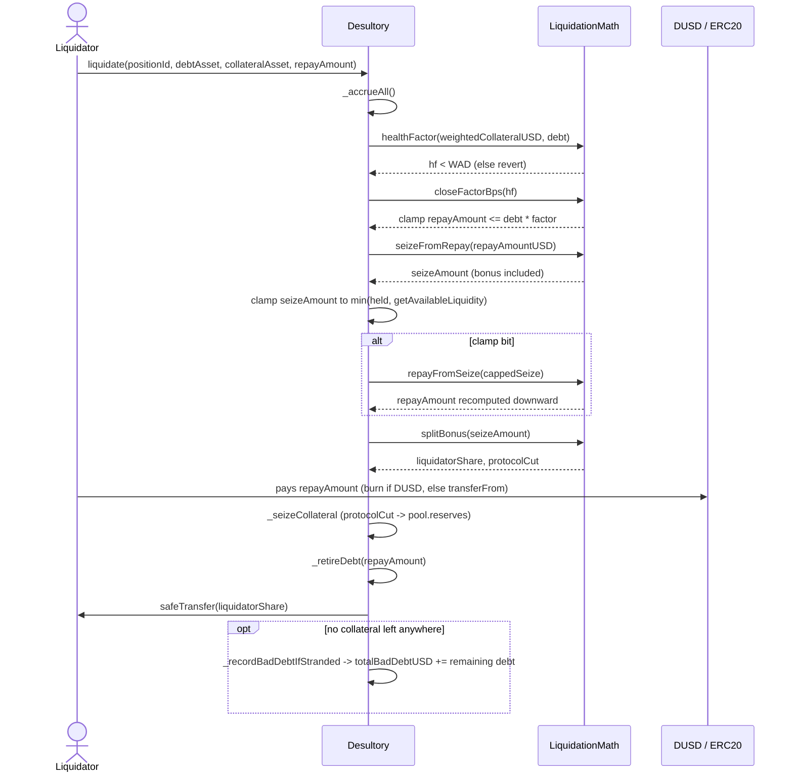

# Liquidations

The old dual-entry-point engine (`liquidateAssetPosition`/`liquidateProportionalPosition`,
all seven defects catalogued below under "History") has been replaced. The current
engine is a single external function:

```solidity
liquidate(uint256 positionId, address debtAsset, address collateralAsset, uint256 repayAmount)
```

## Flow

1. **Accrue everything** (`_accrueAll`), then require `healthFactor(positionId) < WAD`
   (see [[Positions]] for what `healthFactor` means and how it differs from the LTV cap).
2. Resolve `debt`, the position's outstanding debt in `debtAsset` — DUSD or any
   whitelisted pool token (`_debtInAsset`).
3. **Close factor**: `repayAmount` is clamped down (never reverted) to
   `debt * LiquidationMath.closeFactorBps(hf) / MAX_BPS`. Clamping instead of reverting
   means a liquidator bot that loses a race for a *fully* liquidatable position still
   gets a partial fill instead of burning a transaction.
4. **Seizure**: convert the (possibly clamped) `repayAmount` to a USD figure
   (`_debtValueUSD` — DUSD is valued at par, since it has no `__tokenInfos` entry and
   thus no price feed; every other debt asset goes through the oracle), run it through
   `LiquidationMath.seizeFromRepay` (adds the liquidation bonus), and convert to a
   collateral-token amount (`_usdToTokenAmount`).
5. **Clamp to what's actually held, and back-solve.** If the position doesn't hold that
   much of `collateralAsset`, seizure is capped at `getPositionCollateralForToken`, and
   `repayAmount` is **recomputed downward** from the capped seizure
   (`LiquidationMath.repayFromSeize` + `_debtAmountFromUSD`, the exact inverse of step 4,
   using the same DUSD-at-par convention), then re-clamped to `debt` in case rounding
   pushes it back over. Skipping this step and charging the original `repayAmount` for a
   short delivery would be the same class of bug as defect 1 below (wrong-token payout) —
   just harder to see, because both sides are still denominated correctly.
6. **Bonus split**: `LiquidationMath.splitBonus` divides the seize amount between the
   liquidator and the protocol (`LIQ_PROTOCOL_SHARE`, 30% of the bonus lands in
   `pool.reserves`).
7. **Effects**: `_seizeCollateral` removes the seized collateral and books the protocol
   cut; `_retireDebt` reduces the position's debt by exactly `repayAmount`.
8. **Interaction**: `safeTransfer` sends the liquidator's share of seized collateral
   from the contract's own balance — value only ever moves by the liquidator's implicit
   payment (their debt-asset tokens, taken via `_retireDebt`) against protocol-held
   collateral, never a `transferFrom`-then-fallback-to-protocol-funds pattern.
9. **Bad debt sweep** (`_recordBadDebtIfStranded`): if the position now holds zero
   collateral **of every kind** (`userCollateralValueUSD == 0`, not just the asset just
   seized — a position with WETH gone but USDC remaining is still liquidatable by
   someone else) and debt remains, that remaining debt is added to `totalBadDebtUSD`
   and a `BadDebtRecorded(positionId, amountUSD)` event fires.



## Bad debt: counted, never socialized

`totalBadDebtUSD` is a monotone counter of *recognized* loss, snapshotted in USD at the
moment collateral ran out — it does not track prices afterward and is never decremented,
including if the position is later topped up. There is deliberately **no `liquidityIndex`
writedown** anywhere in this path: haircutting lenders' index would break
`property_indexesNeverDecrease` (see [[Accounting]] and the Chimera fuzzing harness).
A real loss-allocation policy (socializing bad debt across lenders, an insurance fund,
etc.) is out of scope for this project.

## Settled design points

- **Close factor** — `LiquidationMath.closeFactorBps(healthFactor)`, a partial-fill clamp.
- **Bonus, and who pays it** — a genuine bonus (not the old penalty-on-liquidator
  inversion), funded by extra collateral seized beyond the repaid value, split 70/30
  liquidator/protocol via `LIQ_PROTOCOL_SHARE`.
- **Health factor with a threshold above LTV** — `healthFactor` is
  threshold-weighted and distinct from the LTV-weighted borrow cap; see [[Positions]].
- **Accrual ordering** — `_accrueAll()` runs before `healthFactor`/`debt` are read.
- **Value movement** — collateral leaves the contract's own balance to the liquidator;
  the liquidator's payment is taken via `_retireDebt`, never a balance-sniff-then-fallback.
- **Bad debt** — recognized and counted (`totalBadDebtUSD`), never socialized onto
  lenders via the index.
- **Cross-chain** — **still unsettled.** Liquidation is single-chain only; a position
  whose collateral and debt sit on different chains has no engine yet. See [[Cross-Chain]].

## Known limitations

- **Payout can revert in a cash-poor pool.** Collateral leaves the contract's own
  balance via `safeTransfer`, with no flash-loan funding and no protocol-funded
  fallback (D2's gap). If the collateral pool is fully lent out, `liquidate()` can
  fail even against a genuinely liquidatable position.
- **`totalBadDebtUSD` is a snapshot, not a live mark.** It is credited once, in USD, at
  the moment a position's collateral hits zero across every asset. It is never
  decremented, and it does not track price movement afterward — a later price recovery
  (or a position top-up) does not reduce it. It is a *recognized-loss counter*, not a
  running mark of protocol insolvency. It can also **over-count**: `deposit()` is
  permissionless, so anyone may re-collateralize a stranded position, and if that
  position strands again later, the same underlying debt is credited to
  `totalBadDebtUSD` a second time — there is no recognition-flag tracking which debt
  has already been counted. The counter is therefore one-directional noise in both
  senses: it can under-state loss (stale USD snapshot, no price tracking) and
  over-state it (repeat stranding of a topped-up position), never an exact live figure.
- **Seizure is bounded by pool liquidity — a bug this harness caught.** The clamp in
  `liquidate()` caps `seizeAmount` at the lesser of the position's collateral held and
  `getAvailableLiquidity(collateralAsset)`, the same bound `withdraw()`/`borrow()`
  already apply. This was **not** in the original design — `_seizeCollateral`
  originally decremented `totalScaledDeposits` with no liquidity gate at all, and
  Medusa failed `property_borrowIndexOutpacesLiquidityIndex` after ~98k calls once
  `liquidate` entered the target surface. Root cause: `accrue()` grows
  `liquidityIndex` faster than `borrowIndex` whenever `0.9 × totalDebt > totalDeposits`,
  a state `withdraw`/`borrow` could never reach but unbounded seizure could. This is
  the **second** real bug this harness has caught, after the `accrue()` interest leak
  documented in [[Accounting]]. See
  `test/Desultory.t.sol:testSeizureIsBoundedByAvailableLiquidity` and
  `.superpowers/sdd/2026-09-12-liquidation-engine/task-7-report.md`.
- **A wei-scale rounding seam remains, deliberately unfixed.** The availability bound
  above is computed in token units, but `_seizeCollateral` converts the decrement with
  `__toScaledUp` (rounds up), so a seizure that exactly saturates the cap can leave a
  pool's deposits 1–2 wei below its debt. This cannot trigger the invariant that caught
  the bug above — that needs roughly a 10% deficit, not a couple of wei — and was
  parked rather than patched with an unexplained `-1` safety margin. Invisible to every
  existing invariant; economically meaningless; real.

## History: the seven defects of the old engine

Kept for context — none of this code exists anymore, but the defects shaped which
invariants the rewrite had to hold.

1. **Paid the liquidator in the wrong token.** `settleDebtSeizeCollateral` transferred
   `tokenToRepay` using an amount denominated in `tokenToLiquidate` — different assets,
   different prices, different decimals.
2. **Seizure unbounded by debt size.** Took 90% of the position's entire balance of a
   collateral token regardless of debt size; no close factor.
3. **Penalty pointed the wrong way** — a haircut on the liquidator instead of a bonus.
4. **Proportional math always rounded to zero** (`valueUSD / totalUSD` in integer
   arithmetic before the numerator was scaled up).
5. **Liquidator intent inferred from `balanceOf(msg.sender)`**, falling back to
   protocol funds when the balance check failed — silently socializing losses onto
   depositors.
6. **Neither path accrued first** — debt was evaluated as of the last unrelated
   interaction.
7. **No liquidation threshold distinct from LTV** — a position became liquidatable the
   instant it maxed out its borrow capacity, with no buffer band.

## Related

- [[Accounting]] — the debt figures a liquidation must read correctly, and why
  `liquidityIndex` is never written down for bad debt
- [[Positions]] — `healthFactor`, the threshold/LTV split, and the transfer gate
- [[Cross-Chain]] — why liquidation is still single-chain only
- [[0004-liquidation-engine]] — the ADR recording why the engine was built this way
- [[2026-06-10-project-assessment]] — the audit that first catalogued the seven defects
